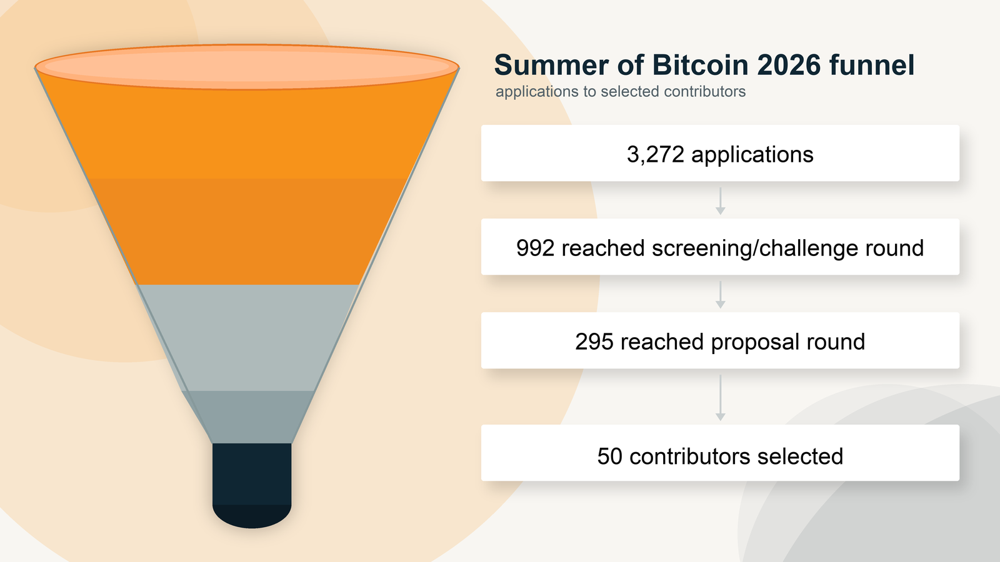

We are excited to announce the results for Summer of Bitcoin 2026!

This year, 50 student contributors have been selected to work with 26 open-source bitcoin organizations across the developer and designer tracks.

## Application Funnel

The 2026 application process brought together a large global pool of students and narrowed it through screening, challenges, proposals, and mentor review.

Here is the high-level funnel:

*   3,272 applicants from 51 countries and 1,813 universities
*   992 students reached the screening and challenge round
*   295 applicants reached the proposal round
*   50 student contributors were selected across 26 open-source bitcoin organizations

<figure>

<figcaption>Summer of Bitcoin 2026 narrowed 3,272 applications into 50 selected contributors</figcaption>
</figure>

## Challenge Round

This year's application process was different from past years. We deliberately designed the challenge round for an AI-native world.

AI tools have made it easier than ever to produce polished portfolios, code samples, and quick one-off submissions. Instead of trying to screen AI out, the challenges raised the bar for using AI well.

The goal was to see who could use AI to deepen their understanding of the Bitcoin protocol, validate assumptions, accelerate real development, and still explain trade-offs clearly.

The strongest applicants were not just generating code. They used AI as a learning and building partner while showing protocol knowledge, judgment, and the ability to ship reviewable work.

Developer applicants worked through real Bitcoin engineering problems: a transaction parser and visualizer, a safe PSBT transaction builder, and a chain-analysis engine using real block data.

Design applicants moved from wallet analysis into user research, persona mapping, and high-fidelity wallet interaction design around keys, backups, payment states, fees, and privacy warnings.

Some of the best submissions were technically rigorous and creative enough to be useful to non-technical users on day one. One student from India demoed a polished chain-analysis tool: [watch the walkthrough](https://www.youtube.com/watch?v=OcI5FrvTMRY).

## Selected Cohort

The selected cohort represents 7 countries: Australia, Costa Rica, Germany, India, Nigeria, Spain, and the United States. It includes 44 developer placements and 6 designer placements.

This year's participating organizations are:

*   asmap, BDK, Bitcoin Core, Bitcoin Design, Bitcoin-Fuzz, Braidpool, and Coinswap
*   ContextVM, Cove, Demand, Fedimint, Floresta, Flotilla, and Formstr
*   Jam, Kern, Krux, Mostro, Nostr Components, Nostream, and SeedSigner
*   Shopstr, smite, Stable Channels, strfry, and VLS

Contributors will work on Bitcoin protocol infrastructure, wallets, developer tooling, privacy, testing, mining, Bitcoin applications, and design projects.

This year's project ideas were scoped with mentors for a 12-week full-time summer window, so students can move from onboarding to meaningful public work in code, design, research, and documentation.

## What Happens Next

All student contributors have been paired with mentors. The project period began on May 18 and continues through August 16.

Over the next couple of weeks, students will get set up in project repositories and communities, confirm milestones with mentors, and begin early implementation or design discovery.

Mid-term evaluations are scheduled for June 29 to July 3.

Upon successful completion of their evaluations, all student contributors will receive stipends in BTC.

Stipends are calculated based on each student's location using a Purchasing Power Parity (PPP) model and paid in two installments after the mid-term and final evaluations.

## Thank You

We are incredibly thankful to our 2026 program sponsors, **Spiral**, **Human Rights Foundation**, **BTrust**, and **OpenSats**, for their generous financial support towards funding student stipends and operations.

We are also thankful to every mentor who reviewed proposals and helped shape student projects. Summer of Bitcoin works because open-source teams make time to turn promising students into real contributors.

## Epilogue

To the thousands of applicants from all over the world who applied to the program, thank you for your effort.

You now have a deeper understanding of how Bitcoin works and have explored projects across the Bitcoin open-source ecosystem. We hope you continue to stay engaged with your favorite open-source communities.

For the students who could not make it, we would like to point you to our [student guide](https://guide.summerofbitcoin.org/being-turned-down), which has suggestions on what to do if you were not selected for this year's program.

It also has a chapter on [Getting started with an organization and project](https://guide.summerofbitcoin.org/the-proposal-round/getting-started-with-an-organization-and-project), which is helpful whether you connect with projects now or apply again in the future - which we hope you do!

---

Here's to the 6th year of Summer of Bitcoin!
