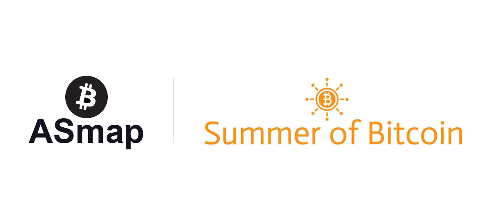
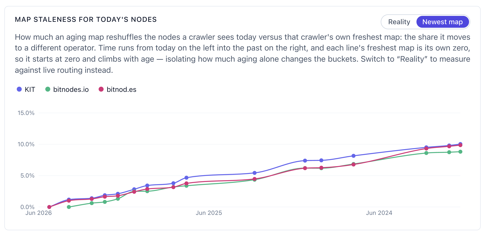
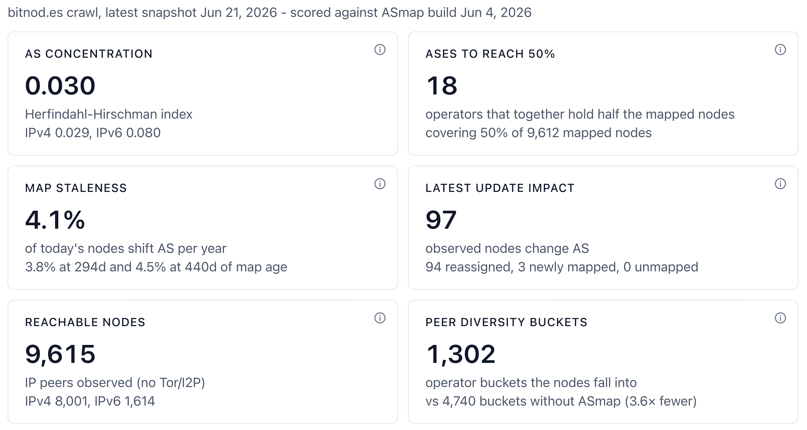

<figure>

</figure>

When people talk about Bitcoin security they almost always picture mining. Hash rate, energy, warehouses full of machines. The part that quietly keeps the network honest gets far less attention. Every node decides who it connects to and those choices are a real line of defense.

A node keeps only a small number of outbound connections. If someone can fill most of those slots with machines they control, they can feed that node a false view of the chain, hide transactions from it, or cut it off from the rest of the network. This is the idea behind an eclipse attack and the defense is easy to state. Connect to peers that sit in genuinely different parts of the internet.

Spreading them out is harder than it sounds. The straightforward approach groups peers by their IP prefix, but a single large provider can own thousands of prefixes and still look like many separate peers. ASmap fixes that. It groups every address by the autonomous system that actually owns it, so one provider counts as one group no matter how many addresses it holds. Since v31 it ships with Bitcoin Core.

Here is the part that pulled me in. ASmap has been worked on for years, yet one basic question stayed open. Once a map is shipped inside a release, when has it aged enough to be worth replacing?

I am Joris, a student and contributor in Summer of Bitcoin 2026, mentored by fjahr and jurraca. My project turns that open question into something you can actually look at.

## What I have built

A dashboard with charts and metrics for this specific question. Its first version is live and you can open it right now:

https://jorisstrakeljahn.github.io/asmap-dashboard/

It walks the full history of published ASmap builds and scores each one against the real Bitcoin network. Instead of arguing about whether an old map still works, you watch its coverage of live nodes fall over time and read the answer straight off the chart.

<figure>

<figcaption>How much an aging ASmap build reshuffles today's nodes, measured against three independent crawlers</figcaption>
</figure>

It has two sides. One side studies the map files on their own, so you can take any two builds and see exactly which networks moved between them and how much address space changed. The other side is the one I care about most. It takes real observed nodes and measures how the maps actually behave on them. How concentrated the network is across a handful of large providers, how much extra diversity ASmap buys over the naive grouping and how stale a given map has become.

<figure>

<figcaption>The Network tab scoring the latest ASmap build against the nodes a crawler actually observed</figcaption>
</figure>

## When my data source disappeared

Getting that live view of the network was the hardest part and it almost did not happen. The plan rested on one data source for the live network, a public crawler called bitnodes.io. In the first week of the program it went offline and never came back. The whole network side of my project depended on it and suddenly it was gone.

What got me out of that hole was other people. fjahr reached out to his contacts and the wider community stepped in. b10c had archived old bitnodes data and shared it. The team at KIT shared what they could. The BitMEX crawler that continues bitnodes today gave me a way forward for the live data. I built one loader that takes all of these. The numbers came back and where the sources overlap they agree almost perfectly.

## What that taught me

The real lesson was not technical. It was how fragile the ground under Bitcoin network monitoring actually is. A crawler that a whole class of analysis depended on was run by one person and when they stopped, it was simply gone. A lot of the data and tooling the ecosystem leans on sits with one maintainer, one server, one person who happens to still care. I ran into that in my very first weeks in open source, on the exact project I was meant to build on.

That changed how I see the work. Tools like this stay alive only if people keep arriving, joining projects and carrying them when others move on. I did not plan my way here. I have been into Bitcoin for over three years and wanted to build on it for a long time, but I never really knew where to start or felt ready to jump into open source. I came across Summer of Bitcoin almost by accident and without it I probably would not have started at all, or found the courage to take part. Now I see it as a rare chance to actually contribute, by helping keep a small but real part of Bitcoin maintained. Programs that bring new people in matter. So do people like fjahr and jurraca, who are willing to spend their time pulling someone new into open source and helping them grow into it. Without that, projects quietly fade. With it, they get a next generation.

The next step is to make the dashboard update itself every day and give it a proper home on a subdomain of asmap.org.

So thanks to them and to the Summer of Bitcoin team, for that opportunity.

If you work with ASmap, run a node, or just find this interesting, I would really like to hear from you. The dashboard is a first version and feedback is what makes it better, so try it out and tell me what is missing or wrong. The best place to reach me is the feedback thread linked below.

## Links

* [The live dashboard](https://jorisstrakeljahn.github.io/asmap-dashboard/)
* [The code on GitHub](https://github.com/jorisstrakeljahn/asmap-dashboard)
* [Place to send feedback to me](https://delvingbitcoin.org/t/asmap-dashboard-tracking-the-asmap-data-history-against-the-observed-network/2652)
* [More about ASmap](https://asmap.org/)
