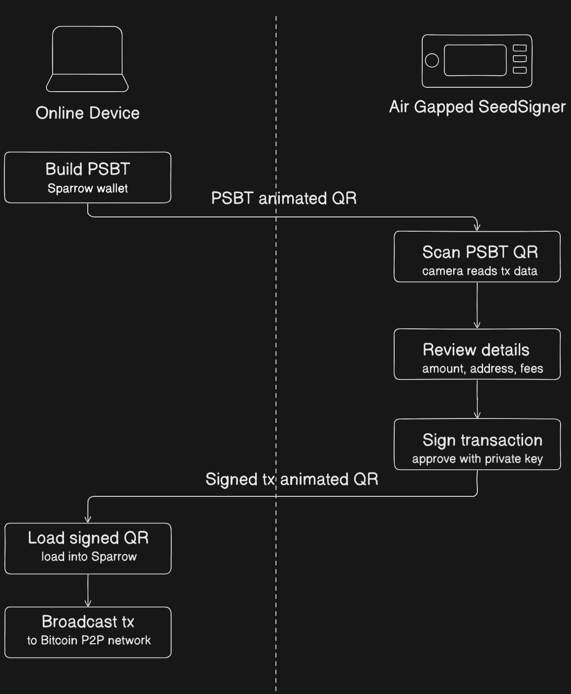
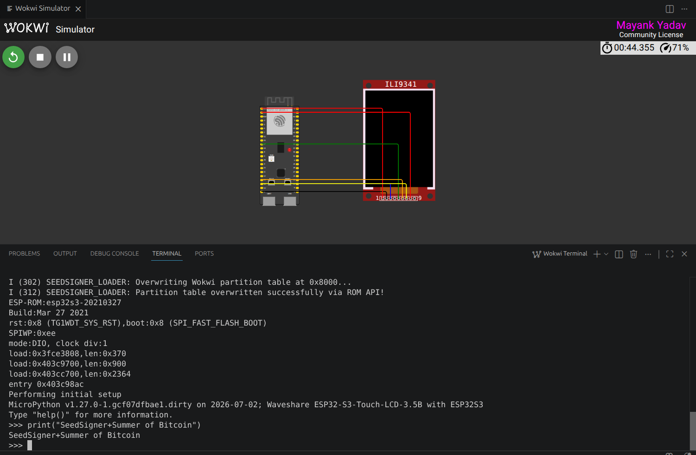

## Who I am and what project I am working on

Hi, I am Mayank Yadav! I am a student contributor for Summer of Bitcoin 2026, working with **SeedSigner**. My project focuses on **MicroPython Port R&D for Secure Boot and Removable Storage**. This involves foundational R&D for a SeedSigner MicroPython port to the ESP32, moving beyond application-level features into core platform work to create a highly secure, generalized bootloader.

## How I came across SeedSigner

I briefly recall seeing SeedSigner when I was exploring the bitcoin.org website along with several other hardware wallets. I didn't pay much attention to it at the time.

When I saw that SeedSigner was participating in Summer of Bitcoin 2026, I knew it would be a great opportunity to finally dive deeper.

It quickly proved to be a fascinating project. I had always understood that private keys should stay offline, but SeedSigner reframed that idea for me: offline is not only about where keys are stored; it is also about how signing workflows are designed end-to-end. That design philosophy is what originally motivated me to write my proposal, and I was absolutely thrilled when I got selected! Now, I am officially contributing to the project to help push these security paradigms forward.

## How SeedSigner works

At a high level, SeedSigner is software that runs on a Raspberry Pi Zero with a camera and display, turning inexpensive, off-the-shelf hardware into an air-gapped (no WiFi, no Bluetooth, no cellular) signing device. Critically, all seeds (read Chapter 4 of [Grokking Bitcoin](https://rosenbaum.se/book/) to recap the concept of seeds, seed phrases, and how they are used to derive private keys) are held in RAM and completely erased when the device powers off. By design, they never persist to disk.

The setup flow is straightforward:

1. Download the latest SeedSigner image from the official project resources.
2. Flash the image to a microSD card.
3. Insert the card into the Raspberry Pi Zero, connect the camera and screen, and boot the device.
4. Once booted, remove the microSD card.
5. Complete the on-device setup prompts.

### Seed Phrase Creation Options

Once running, SeedSigner offers multiple ways to generate or import seed phrases. The design goal remains constant: keep signing keys isolated from internet-connected devices. Here are the primary seed phrase creation methods:

#### 1. **Manual BIP39 Word Selection**
The most trust-minimized approach. You manually select BIP39 words and then use SeedSigner to calculate a valid final checksum word. In SeedSigner, the final-word workflow supports providing the remaining entropy bits via coin flips, manual final-word selection, or zeros before checksum calculation. This method offers maximum control but requires careful manual input. The result is either a 12-word or 24-word complete seed phrase.

#### 2. **Dice Rolls Conversion**
Convert physical randomness into a seed phrase through dice rolls. Roll dice multiple times (50 rolls for a 12-word phrase, 99 rolls for a 24-word phrase) and enter the results into SeedSigner. SeedSigner hashes the roll string (SHA256) and derives the mnemonic from that result. This method provides verifiable, user-controlled randomness and is documented as compatible with verification workflows using Ian Coleman's BIP39 tool and bitcoiner.guide/seed (with the correct input modes).

#### 3. **Camera-Based Image Entropy**
The most convenient method. Take a photograph using SeedSigner's built-in camera, and the device extracts entropy from:
- Pixels in the photograph
- Preview image frames rendered on screen after activation
- Raspberry Pi's unique serial number
- Timing-derived data during runtime

The aggregated randomness from these variables generates your seed phrase. While convenient, this method places the most trust in SeedSigner's code compared to other options.

#### 4. **Existing Seed Import**
Temporarily import an existing seed phrase via:
- Manual word-by-word entry through an optimized interface
- SeedQR scanning (a QR-encoded format of the seed phrase for quick loading)

### Seed Phrase Length and Passphrase Options

- **12-word vs. 24-word seeds**: A 24-word seed captures significantly more entropy mathematically, but in a multi-signature wallet with at least three cosigners, multiple 12-word seeds provide adequate entropy. When using QR transcription (SeedQR), 12-word seeds are less time-consuming.
- **BIP39 Passphrase support**: You can add an optional passphrase (sometimes called the "13th word" for 12-word seeds or "25th word" for 24-word seeds) that transforms the seed into a completely new private key. This provides an additional security layer against seed disclosure.

### SeedQR Transcription

After generating or importing a seed, SeedSigner provides a manual transcription interface to convert your seed into a SeedQR, a scannable QR code format. This single-frame QR code enables instant seed loading in the future without manual word entry, though the transcription process typically takes about 10 minutes. Importantly, your SeedQR should only be scanned by SeedSigner or other QR-enabled hardware signers, never by internet-connected devices.

The transaction flow typically looks like this:

1. Build an unsigned transaction in a software wallet such as Sparrow.
2. Export it as a PSBT (Partially Signed Bitcoin Transaction) QR, often an animated multi-frame code for larger transactions.
3. Scan that QR with SeedSigner, review critical details (amount, destination, and fees), and sign.
4. SeedSigner displays an animated QR containing the signed transaction.
5. Scan that QR back into the software wallet and broadcast it to the Bitcoin network.

Because data moves through QR codes rather than cables or radios, private key operations remain on the air-gapped signer. This sharply reduces the attack surface while still allowing a practical day-to-day Bitcoin signing workflow.

You can look at how it is used in a multi-signature setup in the [SeedSigner Independent Custody Guide](https://github.com/SeedSigner/independent_custody_guide) for more details. The stateless design makes it practical to use a single SeedSigner for multiple independent keys in different multisig wallets, as each power cycle leaves no trace of the previous seed.

## SeedSigner security

Security is layered into almost every design decision in SeedSigner, from download to power-off:

1. **The download is verifiable via PGP and SHA256.** You import the project's public key from Keybase, run `gpg --verify` on the signature file, confirm a "Good signature" with a matching fingerprint, then run a `shasum` check on the image. The key fingerprint is also cross-published on Twitter, GitHub Gist, and SeedSigner.com for independent verification.

2. **Builds are reproducible from v0.7.0 onwards.** Anyone can build the image from source and confirm it is byte-for-byte identical to the official release. Reproducible builds reduce trust by enabling source-to-binary verification, rather than eliminating trust.

3. **The SD card is removed after boot.** Removing the SD card prevents later writes to that card during normal operation, but it does not make a previously tampered boot image safe.

4. **Seeds exist only in RAM and vanish on power-off.** By design, the official software never writes to disk. Remove the power, and the seed is gone, mitigating physical-access attacks that target persistent storage.

5. **No wireless radios.** The recommended Pi Zero 1.3 has no WiFi or Bluetooth hardware at all. Data enters only via QR scan and leaves only via QR display. The air gap is physical, not just a software setting.

6. **Open-source application, volunteer-maintained, no corporate profit motive.** The code can be audited by anyone. The SeedSigner application is fully open source and auditable, although portions of the underlying Raspberry Pi firmware are closed source.

7. **Transaction details are reviewed on-device before signing.** The destination address, amount, and fees are shown clearly on screen before you approve, so a compromised wallet app cannot silently manipulate what you sign.

### Current Pitfalls
 
The security properties above are genuine, but some meaningful gaps remain:
 
1. **No hardware-enforced secure boot.** The Raspberry Pi Zero has no secure boot mechanism. There is nothing in the hardware that cryptographically verifies the software before it runs. A sufficiently motivated attacker with physical access, even briefly, before the SD card is removed, could swap or modify the card and the device would boot the tampered image without complaint. The PGP verification step described above is done by *you*, on your computer, before flashing. Once the card is written and handed off, there is no further chain of trust at boot time.
 
2. **The SD card removal is a manual, trust-based step.** The setup guide instructs you to remove the SD card after booting, but nothing enforces this. A user who forgets, or a device that reaches someone who does not know the protocol, is a device with a live writable storage medium attached. The security of this step depends entirely on the operator.
 
3. **Linux is a large attack surface.** The Pi Zero runs a full Linux-based OS under the hood. For a device whose only job is to sign Bitcoin transactions, this is significant over-engineering. A full OS brings with it a large codebase, kernel drivers, and system processes, most of which are irrelevant to signing but all of which represent potential attack surface.
 
4. **The hardware itself is general-purpose.** The Raspberry Pi was designed as a general-purpose computing board, not a security device. It lacks the tamper-resistance, secure enclaves, and hardware key storage found in purpose-built security chips.

## What problem my project is solving

SeedSigner has strict security and statelessness requirements. Typically, ESP32 firmware executes directly from the built-in flash memory. However, to maintain the stateless nature of SeedSigner and keep it air-gapped from persistent storage vulnerabilities, we want to run the firmware directly from a removable SD card rather than the built-in flash.

My project aims to build a shared verification core and secure bootloader capable of cryptographically validating firmware from an SD card. By collaborating with developers from related projects like Kern and Specter-DIY, the goal is to build an architecture that supports ESP32 while respecting the unique security constraints of Bitcoin hardware wallets.

## What I completed in the first six weeks

I'm excited to share that I'm currently ahead of expected progress! During the first half of the program, I have:

* **Conducted deep research:** Wrote a comprehensive literature review analyzing the Specter-DIY bootloader, ESP-IDF internals, and Kern architecture. Through collaboration with upstream maintainers, this led to the design of a Hybrid Secure Boot architecture.
* **Prototyped Secure Boot:** Built a basic Secure Boot prototype on QEMU (ESP32-S3). I enabled Espressif's native ESP-IDF Secure Boot v2 and successfully tested failure modes (unsigned, wrong key, and revoked key).
* **Built an SD Card Loader:** Created a working prototype of a 3rd-stage App-Based Secure Loader for SD Card Boot. To prevent Time-of-Check to Time-of-Use (TOCTOU) attacks, I designed a stateless Cache MMU Hijack mapping that routes instruction caches directly to physical RAM.
* **Achieved end-to-end execution:** Connected the Layer 1 Secure Boot v2 hardware locks with the Layer 2 App-Based loader in QEMU. I successfully verified a payload using `secp256k1` tooling and executed the actual `seedsigner.bin` payload directly from PSRAM.
* **Resolved deep architectural constraints:** Solved complex IRAM/DRAM access violations, MMU misalignments, and stack self-overwrite bugs by meticulously managing memory boundaries and relocating the payload jump function to isolated RTC memory.
* **Upgraded the environment:** Transitioned to ESP-IDF v6.0.1 and successfully compiled the official SeedSigner MicroPython build for both ESP32-S3 and the upcoming ESP32-P4 architecture, fixing missing LVGL configurations along the way.
* **UI Emulation & Validation:** Used Wokwi's virtual hardware emulation to visually verify the SeedSigner UI. Successfully resolved PSRAM mismatches, bypassed bootloader limitations, and executed the raw MicroPython OS to a fully interactive REPL prompt on the ESP32-S3 architecture.

*(While this terminal prompt may not look like a big thing, making this work statelessly was incredibly hard!)*

## The hardest problem I faced

The most challenging problem was managing the strict memory limits and execution contexts on the ESP32 while trying to load an external payload statelessly. I ran into a "Cache-22" scenario, IRAM corruption, stack self-overwrites (where the active CPU stack was destroyed during memory copying), and hidden MMU misalignment bugs caused by the 256-byte Specter header. Additionally, when validating the UI using Wokwi emulation, I encountered complex hardware mismatches. Booting the MicroPython OS resulted in SPI SRAM panics and I2C NACK log spam because the simulator lacked support for specific hardware like Octal SPI PSRAM and the Waveshare display controllers.

I overcame the memory limits by forcing the loader into unicore mode, dynamically rewriting the Cache MMU logic (`mmu_hal_map_region`) so that instructions branch natively from external PSRAM, and relocating the critical bootloader jump function to isolated RTC memory to safely pivot the CPU stack. For the Wokwi emulation issues, I explicitly configured Octal PSRAM, bypassed ROM bootloader limitations by directly booting the ELF file, and conditionally patched the LVGL drivers to prevent crashes. Debugging these issues was heavily restricted by the limitations of the QEMU and Wokwi emulators, which proved how essential physical hardware is for testing and hardening Secure Boot integration moving forward.

## What I learned about Bitcoin, open source, or software/design

On a technical level, my most valuable learning has been seeing just how much strictness is required for embedded security engineering. Learning to predict edge cases, like TOCTOU attacks and memory corruption vulnerabilities from untrusted SD card headers, has completely changed how I write low-level C code. I also gained a deep understanding of the differences between hardware-enforced immutability (using eFuses) and software-based verification.

On the open-source side, I was blown away by the supportive cross-project collaboration. Maintainers from completely different hardware wallet projects shared their internal problems, design ideas, and unreleased documentation to help me build a better shared foundation for the ecosystem. 

## What I plan to finish before the final evaluation

My primary goal for the second half of the program is to deliver a production-ready, highly secure ESP32 bootloader that reliably verifies and loads MicroPython firmware from an SD card into PSRAM. 

To achieve this, my upcoming milestones include:
* Transitioning the QEMU-based prototype to real physical ESP32 boards.
* Troubleshooting real-world timing, memory, and hardware constraints.
* Conducting extensive testing across various ESP32 boards (like ESP32-S3 and ESP32-P4) for cross-device compatibility.
* Completing a full security analysis and documenting the complete hardware threat model.

## Conclusion

As I head into the second half of Summer of Bitcoin, I'm incredibly excited about the path forward. Moving from emulators to physical ESP32 boards will undoubtedly uncover new challenges, but the foundation built so far is strong. The cross-project collaboration has been inspiring, and I look forward to contributing a secure, stateless bootloader that the entire open-source hardware wallet ecosystem can benefit from.

If you'd like to dive into the technical details, review my code, or follow my progress, please check out my work artifacts below or reach out to me. Feedback and contributions are always welcome!

* [SeedSigner-SoB Repository](https://github.com/wolgwang1729/SeedSigner-SoB)
* [Literature Review](https://github.com/wolgwang1729/SeedSigner-SoB/blob/main/LiteratureReview.MD)

*(Featured image credit: [Keith Mukai on X](https://x.com/KeithMukai/status/1472777702952349696?s=20))*
