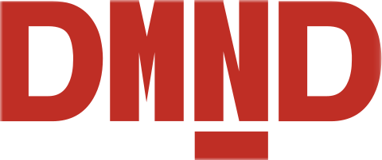
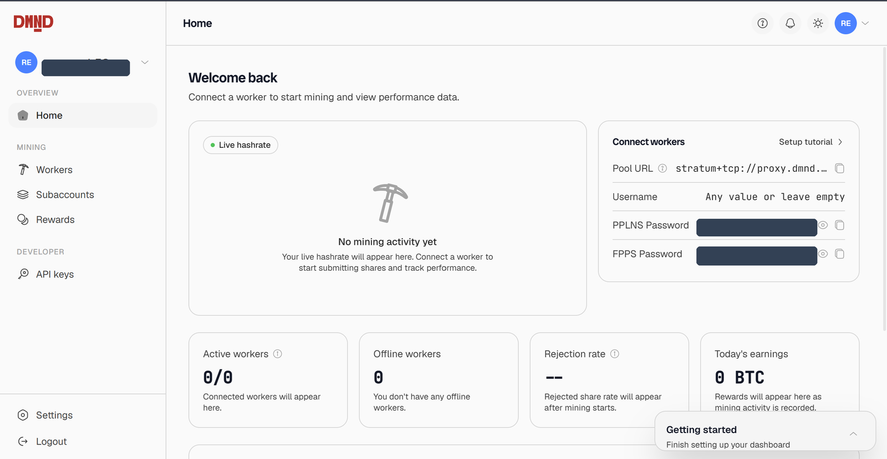

## Who I am and what I'm working on

I'm Jyotiraditya Panda (rx18-eng on GitHub), a first-year CSE undergrad from India. For Summer of Bitcoin 2026 I'm working with DMND (Demand) as a frontend developer, building the open-source miner dashboard for their Stratum V2 mining pool.

The pool already has a dashboard running in production. My job is to bring that whole experience into the open-source repo ([dmnd-pool/sv2-ui](https://github.com/dmnd-pool/sv2-ui)), so anyone running the stack gets a real dashboard, and the community can build on it instead of it sitting behind closed doors.

## What problem my project is solving

DMND is the first Bitcoin mining pool built from the ground up on Stratum V2, the newer mining protocol. Stratum V2 does two big things that the old V1 protocol didn't. It encrypts the connection between miners and the pool, so nobody in the middle can quietly steal a miner's hashrate, which is an actual attack that V1's plaintext connections allow. And it adds something called Job Declaration, which is the part that matters most.

Here's the problem Job Declaration solves. Right now a handful of pools control most of Bitcoin's hashrate, and in the old model the pool is the one that decides which transactions go into the blocks its miners find. That's a lot of power sitting with very few people. If those pools ever wanted to, or got pressured to, they could leave certain transactions out. Job Declaration flips it: the miner builds its own block template, picks the transactions, and the pool just validates and coordinates the work without dictating what goes in. The way DMND puts it, the miner "keeps the economics and convenience of pooled mining while taking back control of what goes into the block."

And this stopped being theoretical while I was working on the project. On June 26 2026, DMND [mined block 955,318](https://blog.dmnd.work/dmnd-mines-the-first-known-bitcoin-block-using-stratum-v2-job-declaration/), the first known Bitcoin block ever produced using Stratum V2 Job Declaration. So the whole idea the pool is built around just went from specs and test setups to a real block on the public chain, which was a pretty cool thing to be around for.

On top of that, DMND pays miners through a model called SLICE, which is built so that even a miner who powers their machines down to help stabilize the electricity grid still earns for the work they already did. That's a real change from how most pools treat downtime, and it's aimed squarely at miners doing demand response with energy providers.

So that's the pool. But a miner still needs to actually see and control all of it: their live hashrate, which workers are online, what they've earned, their payout history, connecting new machines, and managing subaccounts for different sites. The production dashboard that does this isn't open source, and the open-source repo was mostly a local control panel for the mining stack, with no cloud dashboard at all. My project is building that full miner dashboard out in the open, so anyone running the stack gets a real one and the community can keep improving it.

The featured image at the top of this post is roughly how the pieces fit together: miners talk Stratum V2 to a local proxy (dmnd-client), the pool lives in the cloud, and the dashboard I'm building pulls from both a local source and the cloud.

## What I completed in the first six weeks

A fair amount shipped. Working against dmnd-pool/sv2-ui, I've had four PRs merged so far:

- the authentication screens (sign in, sign up, forgot/reset password)
- a cross-tab session fix, so refreshing or opening a second tab doesn't silently log you out
- the broker auth screens (DMND has a separate broker/partner login)
- the dashboard shell and account setup flow: the sidebar, the app layout, and the post-login 2FA and bitcoin-address setup

On top of that, the home page (live hashrate, connect-workers info, the stat cards, and the PPLNS/FPPS chart) is up as a PR in review, and the workers page and subaccounts page are both built, tested, and queued behind it.

*The dashboard home: connect a worker and your live hashrate, workers, and earnings show up here. (pool passwords blanked out for this screenshot.)*

Each of these went in with tests, browser checks in light and dark mode, and pixel matching against the designer's Figma on both desktop and mobile. I also opened a small fix on DMND's Rust client (dmnd-client) along the way.

## The hardest problem I faced

Keeping one login sane across browser tabs.

It sounds simple, but the dashboard deals with real money, so the session rules are strict. A refresh shouldn't log you out. Opening the dashboard in a second tab should work. But the same account shouldn't be live in two tabs at once, and an idle session should time out on its own. Getting all of those to be true at the same time was the trickiest thing I built.

The way it works is that each tab holds the session, and tabs talk to each other over a browser channel, so if you sign in as the same account somewhere else, the older tab steps down. The bug that ate my time was this: in development, just refreshing the page logged me straight out, every single time.

It turned out React runs some of your setup code twice in development on purpose, to help catch bugs. My cross-tab "claim the session" logic was running too early, so the second copy of it was wiping the first copy's session before the page had even finished loading. The fix was to only start listening on that channel once the component is actually mounted, so a copy that gets created and thrown away never touches anyone else's session. It shipped as its own small PR.

What I liked about this one is that it only showed up in development, which is exactly the kind of bug you can stare at for an hour before it clicks. Once I understood why React was double-running things, the fix was tiny. Understanding it was the whole battle.

## What I learned about Bitcoin, open source, and software

On the Bitcoin side, I finally get Stratum V2 and why people care. Job Declaration isn't an abstract feature, it's the part that takes "who decides what goes in a block" away from a few pool operators. I also went deep on SLICE, DMND's payout model. It's PPLNS plus Job Declaration, and the clever bit is the lookback window of about eight blocks, which is what lets a miner power down for the grid and still get paid for the work they already did. The dashboard has to explain that to people, so I had to actually understand it.

On the open-source side, the biggest thing was the quality bar. A lot of PRs to these repos get closed without merging. You earn the merge. That pushed me to fix one thing per PR instead of piggybacking, to mirror the patterns already in the codebase instead of inventing my own, and to match the repo's existing test setup even when I'd personally have reached for something else. Squash your commits, sign them off, write the PR description like a human. Boring stuff that turns out to matter a lot.

On the software and design side, I learned how much actually goes into making a UI both pixel-accurate to a design system and properly responsive at the same time, not one or the other. And a surprising amount of the job was reading the real running system instead of trusting the docs, which I did not expect going in as a frontend dev.

## My mentors

I got genuinely lucky with mentors. Esraa ([jbesraa](https://github.com/jbesraa)) and Prisca ([Priceless-P](https://github.com/Priceless-P)) at DMND set a high bar but were friendly and patient the whole way through. They gave me real time, walked me through the production dashboard live so I understood what I was actually building, answered a lot of questions including some pretty basic ones, and reviewed my work carefully instead of rubber-stamping it. I also worked closely with Frieda, the designer, who kept handing me clean Figma frames and feedback to build against. Honestly, a big reason this has gone well is that none of them ever made me feel like I was bothering them. As a first-year, that matters more than I can explain.

## What I plan to finish before the final evaluation

First, get the pages that are already built (home, workers, subaccounts) reviewed and merged. After that, the rest of the dashboard: the payouts page (on-chain payout history), the generated-BTC view for FPPS miners, the API keys page, the account switcher for opening a subaccount, and the aggregated view across all subaccounts. Then account settings, more test coverage, and getting the whole thing deployed somewhere people can actually click around.

The goal by the end is a dashboard a real DMND miner could use day to day, fully in the open.

## Links to my work

- DMND dashboard repo: [dmnd-pool/sv2-ui](https://github.com/dmnd-pool/sv2-ui)
- Merged PRs: auth [#5](https://github.com/dmnd-pool/sv2-ui/pull/5), cross-tab fix [#6](https://github.com/dmnd-pool/sv2-ui/pull/6), broker auth [#7](https://github.com/dmnd-pool/sv2-ui/pull/7), shell + account setup [#11](https://github.com/dmnd-pool/sv2-ui/pull/11)
- Home page (in review): [#13](https://github.com/dmnd-pool/sv2-ui/pull/13)
- My fork: [rx18-eng/sv2-ui](https://github.com/rx18-eng/sv2-ui)
